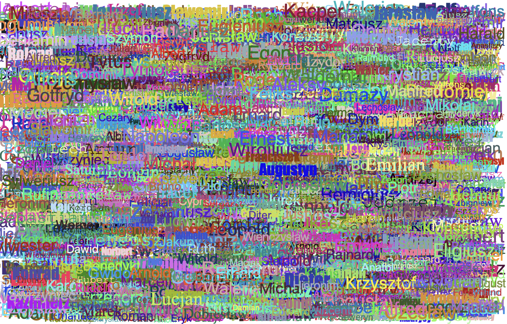

Congratulation to all of you for particiapting to the Tutorial Meeting CS Hackathon.
Here's the winners for the different rounds:

## Academics round:
The task whas to produce an art piece using python turtle.

The selected final winning group is the following:

Group W
- za275
- jymt202
- kl572
- srm227
- js1540
- mpcr201

>Beauty In Diversity is a piece that visualises the diversity in students, academic staff and learning opportunities at the University of Exeter. The different names in all shapes, sizes and colour come together to form something beautiful. It symbolises the people from such diverse backgrounds that come together to study at the University. It is a reminder that there is beauty in diversity and a visual representation of how diverse Exeter truly is.

>When my team came together, we realised that we all came from different countries, speak different languages and had different backgronuds. As a result of this interesting pairing, we decided to create a piece that would best represent our group's diversity and our understanding of it.

## Computer Society Round
The task was to produce an algorithm to win at tetris.

The winning team is group overwriters:
- lb1027
- jr875
- ba438
- jb1500
- Ben Giles

You can witness the different algorithms at play here :
https://www.youtube.com/watch?v=fiCimSpGldQ

## Computer Science Student Reps Round
The task was to solve a collection of Python Puzzles.

The winners are:
am1682 Alex Morgan
fv256 Finn Van Mortan
je497 Jamie Elder
tr457 Taylor Roel
jh1476 James Heppell

The top three scoring groups are:

- The Middle Table - 80 Points
- Group W - 75 Points
- erhjje - 70 Points
